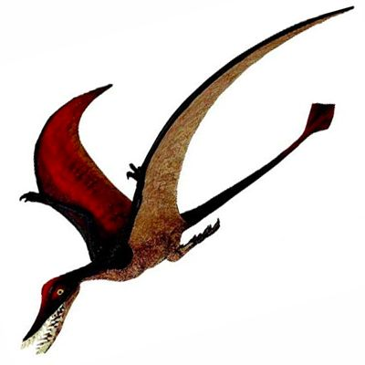

# Chapter 1

> This is a block quote of a some paragraph. This is a block quote of a some paragraph. This is a block quote of a some paragraph. This is a block quote of a some paragraph. This is a block quote of a some paragraph. This is a block quote of a some paragraph. 

>>>> This is a block quote of a some paragraph. This is a block quote of a some paragraph. 

## This is starting something
Here's an Image 
{:width="100%"}
